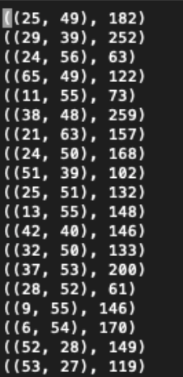

# Distributed Data Processing using PySpark and Apache PIG
Using Virtual ROGER, a high-performance computer of U of I's [CyberGIS Center for Advanced Digital and Spatial Studies](https://cybergis.illinois.edu/infrastructures/), two distributed data processing jobs were run on a Hadoop cluster using PySpark and Apache PIG. These scripts were written in part for the final exam of GEOG 407 CyberGIS and Geospatial Data Science in the Fall of 2021 at UIUC. 

## Apache PIG
The first problem asked me to write an Apache PIG script which takes [NYC Taxi](https://www1.nyc.gov/site/tlc/about/tlc-trip-record-data.page) data as the input and outputs a text file which could then be used to create a raster which shows fare density (taxi_fare / passengers_in_taxi) for each raster cell. The raster must use the bounding box and grid size (in degrees) shown below. A user-defined function (UDF), written in Python, should be used to calculate the fare density. 

| Constraint | Value |
|------------|-------|
| Min. Longitude | -74.25 |
| Min. Latitude | 40.49 | 
| Max Longitude | -73.70 | 
| Max Latitude | 40.92 |
| Grid Size | 0.005 |

Files related to this problem: 
- [fare_density.pig](fare_density.pig): The PIG script. The script loads the data, filters and cleans the data based on the above constraints, groups the data by the raster cell key (which is a `(lat,lon)` tuple), and calls the UDF python script to calculate the average fare density of each raster cell. 
- [udf.py](udf.py): Python script that actually calculates the fare density for each raster cell. The @outputSchema decorator is used so that Pig is able to understand and parse the return type. 
- [fare_density_output.txt](fare_density_output.txt): Text file which contains the output of the data processing job.

To run the Pig Script: 
```bash
pig fare_density.pig
```

To get the output from the Hadoop Distributed File System (HDFS) to the local file directory:
```bash
hdfs dfs -getmerge fare_density_output fare_density_output.txt
```

## PySpark
In this problem, I was asked to write an Apache Spark program which takes [Chicago 311 Service Request](https://data.cityofchicago.org/Service-Requests/311-Service-Requests/v6vf-nfxy) data and output a text file which could be used to create a raster heatmap that shows the number of compaints in each cell. The raster must use the bounding box and grid size (in degrees) shown below. The Spark job should use PySpark, an interface to Apache Spark in Python. 

| Constraint | Value |
|------------|-------|
| Min. Longitude | -87.91 |
| Min. Latitude | 41.64 | 
| Max Longitude | -87.52 | 
| Max Latitude | 42.03 |
| Grid Size | 0.005 |

File related to this problem: 
- [chicago311_pyspark.py](chicago311_pyspark.py): Python script that's submitted to Spark.

The backbone of the script is really this line: 
```python
result = dataset.flatMap(makeIndex).reduceByKey(lambda a,b: (a+b))
```

The `makeIndex` function that is passed to `flatMap()` receives each line from the 311 dataset, strips and splits the line by commas, checks for empty lat/lon coordinates and assigns each one to an lat/lon object. Using the objects containing each lat/lon coordinate, we can create the raster index and return an intermediate key-value pair tuple `(raster_index, 1)`. This tuple is passed to `reduceByKey()` which calculates the total number of complaints for each key in the tuple using a lambda function. 

To run the Spark job: 
```bash
spark-submit --num-executors 18 \
             --executor-cores 2 \
             --executor-memory 4g \
             chicago311_pyspark.py \
             41.64 42.03 \ #minimum and maximum latitude
             -87.91 -87.52 \ #minimum and maximum longitude
             0.005 #grid size
```

Here's a preview of the output text file:


